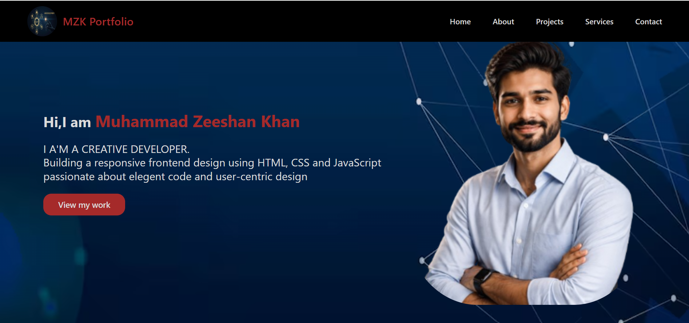
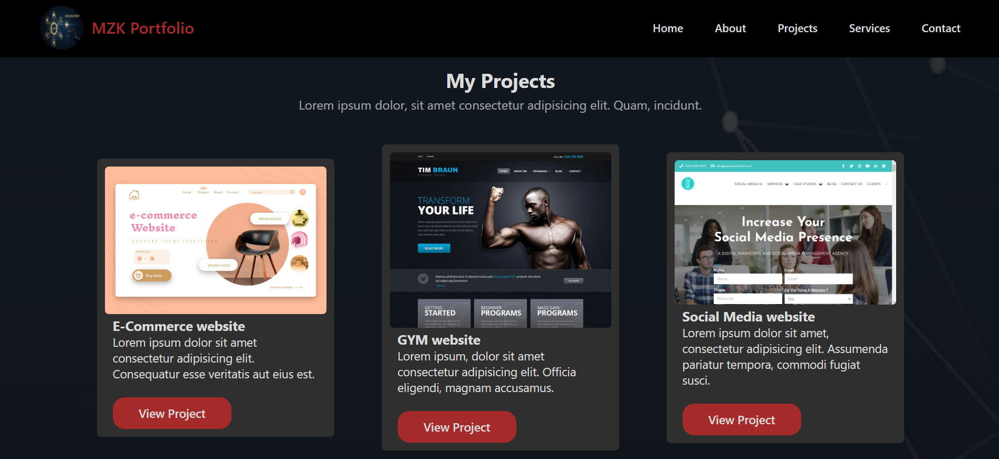

## MY First Web Development Project: Personal Portfolio

Welcome to my very first project! This is a simple personal portfolio website built  while I  was starting  my journey into frontend development.It'sa practice project focused on learning HTML and CSS.

   ##  Project Goals

The main purpose of this project was practice in HTML CSS and Git & Github 

# Built With
HTML: For the page content and structure.
CSS: For styling and basic design

